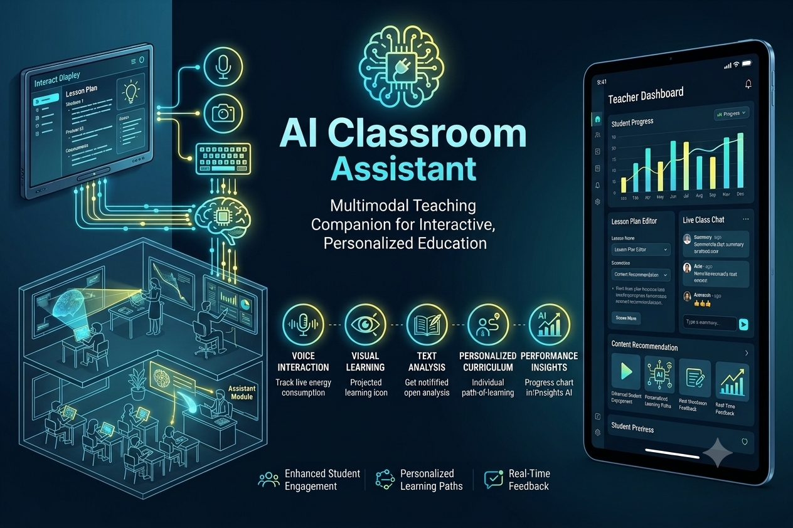

# Intel-project

<h1>:rocket:AI-Classroom-Assistant<p>
  
#### This repository contains the project files and design flow for the AI Classroom Assistant, developed as part of Intel Unnati Project.



🤖 AI Classroom Assistant – Smart Multimodal Teaching Companion & Personalized Education Platform

The AI Classroom Assistant is a smart, multimodal teaching companion designed to enhance the learning experience for students and assist teachers in delivering interactive, personalized education. Built to bridge the gap between traditional teaching and modern AI capabilities, this assistant seamlessly understands and responds to voice, text, and visual inputs in real time. The project combines multimodal AI processing, an interactive classroom interface, automated lesson planning, and deep performance analytics into a unified, student-centric platform.

📌 Project Overview
Modern classrooms face a significant challenge: teachers are often stretched thin, making it difficult to provide real-time, personalized attention to every student's unique learning pace. The AI Classroom Assistant was built to solve this by acting as a co-pilot in the classroom. It provides immediate, adaptive feedback to students during lessons, assists educators with automated content curation, and delivers real-time analytics on student engagement and progress. 

Designed with the needs of schools, digital learning platforms, and independent educators in mind, this project represents the future of smart classrooms, virtual academies, and accessibility-first educational technology.

📂 Files and Components
*   **AI_Classroom_Assistant.py** – Main application script and orchestration engine. Handles real-time multimodal streaming, state management, and the central system interface.
*   **student_dataset.json** – Structured academic dataset containing curriculum benchmarks, sample multi-subject quiz items, and student progress metrics across various difficulty levels (elementary, middle, and high school).
*   **Dashboard & UI Assets** – Includes the front-end interface, wireframes, and live teacher/student dashboard components used to display real-time engagement and lesson timelines.

⚙️ Technologies Used
*   **Multimodal AI Models** – Core vision, speech-to-text, and natural language processing engines for processing real-time student inputs.
*   **Python / Development Frameworks** – Application backend, API management, and real-time processing pipelines.
*   **JSON & Structured Databases** – Data layer for storing student profiles, personalized learning paths, and curriculum mapping.
*   **Interactive Dashboard UI** – Tailored interfaces for both teachers (analytics, curriculum controls) and students (interactive workspace, live help).

🧠 How the AI Classroom Assistant Works
The system models an intelligent, adaptive learning environment where every interaction is continuously evaluated:
*   **Multimodal Input Processing:** The assistant listens to voice queries, reads text submissions, and analyzes visual cues (such as diagrams or handwritten work) simultaneously.
*   **Contextual Evaluation:** The core AI engine checks student responses against curriculum benchmarks to classify comprehension levels in real time (e.g., Proficient, Review Needed, or Critical Help Needed).
*   **Adaptive Learning Loop:** Based on live evaluation, the system automatically recalibrates the learning path for individual students—offering advanced material to quick learners while generating targeted, simplified explanations for those struggling.

The platform then:
*   Generates instant, conversational explanations for complex academic topics.
*   Identifies specific knowledge gaps across the classroom and alerts the teacher.
*   Visualizes real-time engagement and performance metrics on a centralized dashboard.
*   Recommends tailor-made homework modules based on daily classroom analytics.

🚀 Project Features
*   **Real-Time Voice & Visual Interaction:** Students can ask questions out loud or hold up their work to get immediate step-by-step guidance.
*   **Automated Lesson Plan Editor:** Helps teachers generate, modify, and optimize curriculum paths on the fly.
*   **Dynamic Content Recommendation:** Automatically pulls relevant multi-subject text, graphics, and interactive modules based on current performance.
*   **Live Classroom Analytics:** Gives educators a birds-eye view of student attention, progress trends, and participation rates.
*   **Personalized Path-of-Learning:** Adapts dynamically to individual pacing, supporting elementary through high-school level competencies.
*   **Instant Feedback Loops:** Delivers micro-assessments and immediate, encouraging corrections without delaying the class workflow.

🎯 Target Users / Customer Base
*   **Educators & Teachers** looking to automate administrative tasks, track student health metrics globally, and deliver hyper-focused lessons.
*   **Students** who require personalized, interactive, and immediate assistance to master challenging concepts at their own pace.
*   **Schools & EdTech Institutions** aiming to implement scalable, cutting-edge AI tools to improve overall classroom performance and student engagement.
*   **E-Learning Platforms** seeking an automated, multimodal mentor framework to scale virtual tutor systems.

👨‍💻 Team / Project Context
Developed as a smart educational software solution, the AI Classroom Assistant merges advanced technical AI engineering with practical pedagogy and user-centered design. The project focuses heavily on creating an intuitive, low-friction environment for both teachers and students, demonstrating how cutting-edge multimodal AI can be turned into a seamless, everyday classroom utility.

```

<h1>Video References<p>

# Text generation


https://github.com/user-attachments/assets/9ed2dba4-5758-474d-9940-230bf72d9c4f


  
# Audio to text


https://github.com/user-attachments/assets/6fa0bf02-3b81-4e19-b2e7-d1f852321f2d


# Audio to Audio


https://github.com/user-attachments/assets/5eadebf8-c70a-415b-aa0f-c26f4f9c115a


# Final


https://github.com/user-attachments/assets/e2e3301b-d876-4fe9-994a-8e22b2a940c7


